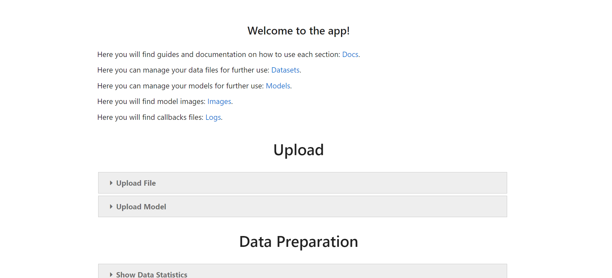
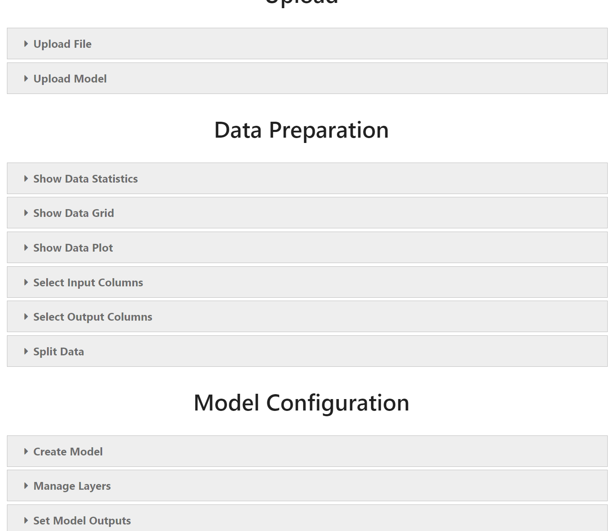
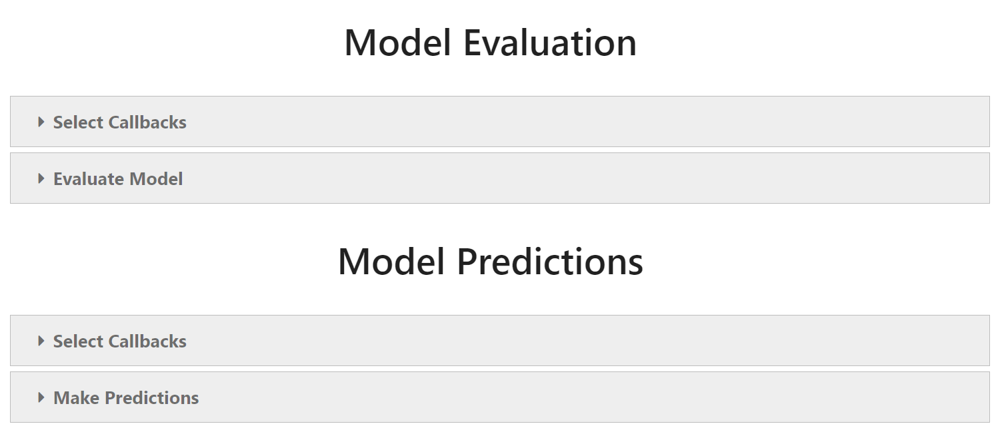

User Manual
===========

Start
-----

If you are using **Binder**, there is no need to install anything, because the app will be built automatically. However, if you want to install it locally, follow the instructions in :doc:`LocalInstallation`. Here is a quick reference on how to start **Voilà** on **Jupyter** server.

.. image:: gifs/start_app.gif
   :width: 80%

Links
-----

To successfully use the app, you need a properly formatted Dataset (:ref:`requirements <AcceptedInput>`), which you can upload to **Jupyter** server via the given link. Other files, like Models, Graphs, Logs from Callbacks, which you will create during the session, could also be found via the corresponding links. You can download files as well.

Upload
------

After uploading your Dataset and, optionally, Model to **Jupyter** server, you need to upload them inside the app itself. Here is how.

.. image:: gifs/upload.gif
   :width: 80%

Data Preparation
----------------

In this section, you can explore a Dataset: display its portion, examine some statistics, plot different columns and save the result figures. Everything is straightforward.

.. image:: gifs/data_preparation_1.gif
   :width: 80%

You can also set columns to be passed to each Model Input and Output as well as split Data into Train and Test portions. This is essential for the further training process. Use *Shift* and *Ctrl* keys to select multiple sequential or distinct columns.

Model Configuration
-------------------

If you haven't got any Model yet, you can create and configure one in this section. Firstly, enter the Model name to create it. Secondly, configure the Layers. There are several types of Layers currently in the app, which you can read about `here <https://www.tensorflow.org/api_docs/python/tf/keras/layers>`__. Finally, you should set Outputs in order to construct and view the Model.

.. image:: gifs/model_configuration_1.gif
   :width: 80%

After the construction, you can display Summary and Graph as well as save the Model. Graph image and Model configuration file could be found inside **Images** and **Models** folders, respectively.

.. image:: gifs/model_configuration_2.gif
   :width: 80%

Model Compilation
-----------------

In this section, you can compile either uploaded or created Model. Choose an Optimizer with some hyperparameters first, then select Loss Functions and optional Metrics for each Model Output. Useful links: `Optimizers <https://www.tensorflow.org/api_docs/python/tf/keras/optimizers>`__, `Loss Functions <https://www.tensorflow.org/api_docs/python/tf/keras/losses>`__, `Metrics <https://www.tensorflow.org/api_docs/python/tf/keras/metrics>`__.

.. image:: gifs/model_compilation.gif
   :width: 80%

Model Training
--------------

In this section, you can train the compiled Model. Select some optional Callbacks (explore them `here <https://www.tensorflow.org/api_docs/python/tf/keras/callbacks>`__) for the training process, then specify hyperparameters and start training. It will take some time depending on the resources you have. After that, you can inspect and save plots of Loss Functions and Metrics from training history as well as save the trained Model.

.. image:: gifs/model_training.gif
   :width: 80%

Model Evaluation
----------------

In this section, you can evaluate either trained or uploaded Model using compiled Loss Functions and Metrics on a Test Data. If you upload already trained Model and only want to evaluate its performance, then select Test Data portion as 100% in **Data Preparation** section.

.. image:: gifs/model_evaluation.gif
   :width: 80%

Model Predictions
-----------------

In this section, you can use either trained or uploaded Model to predict new values from the given Data. It is not recommended for this purpose to use the same Dataset as for training, because Model will be biased.

