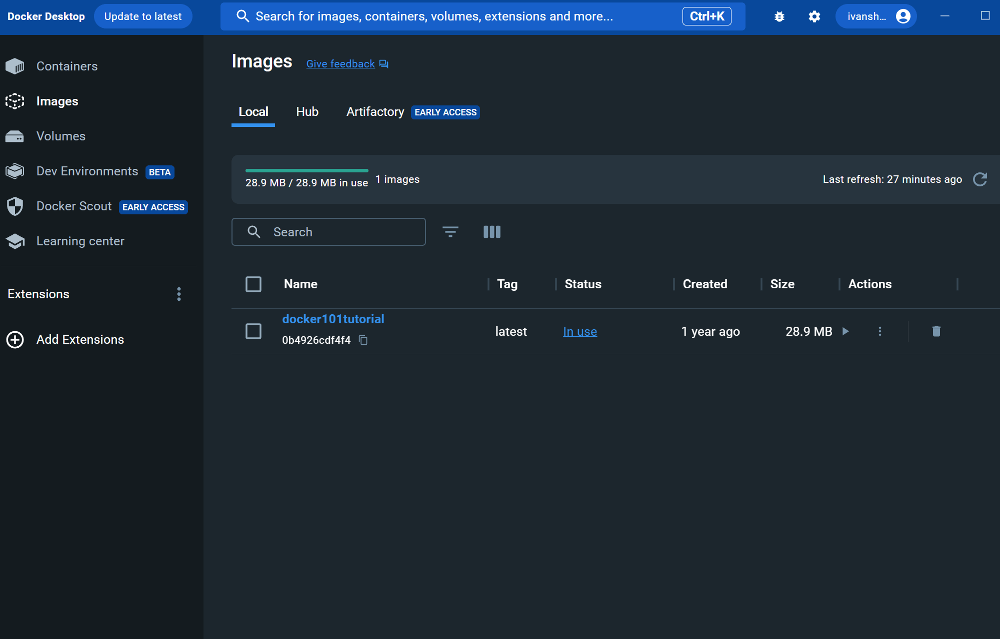
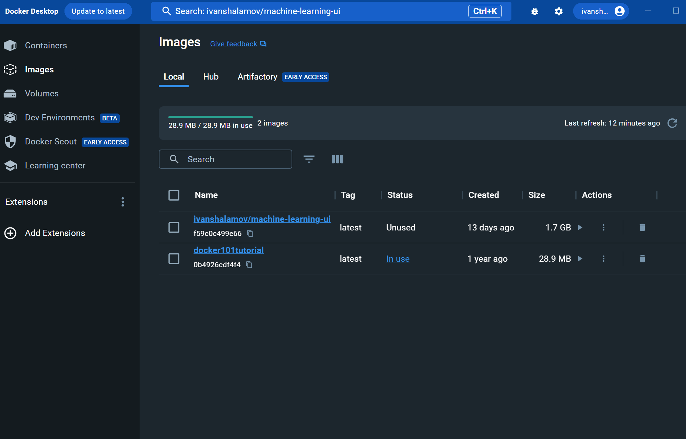
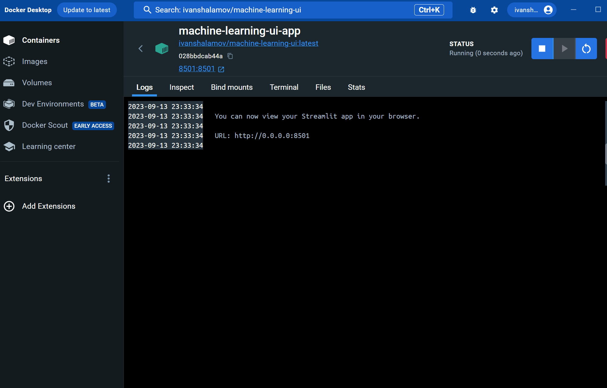
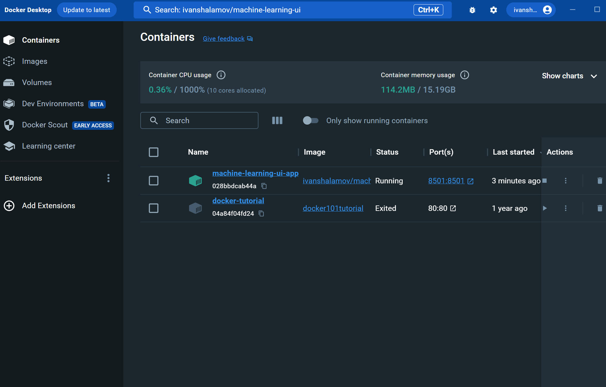
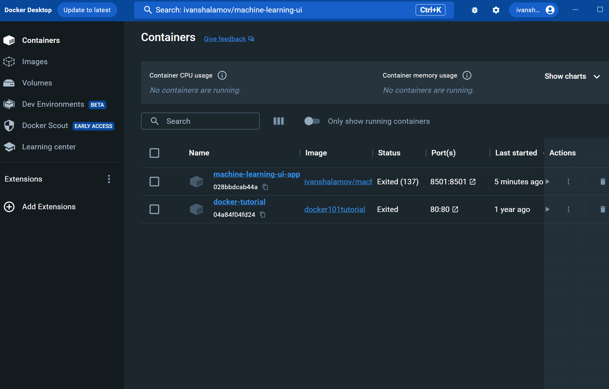

Local Installation
==================

## Installing via Docker (Recommended)

### For Usage

1. Install Docker for your system by following the official guide: [Docker Installation](https://docs.docker.com/engine/install/).
1. Open Docker Desktop, navigate to the search bar at the top or press `Ctrl+K`, type `ivanshalamov/machine-learning-ui`, and pull the `latest` image. Wait for it to download.
    > Periodically check for updates of the image by clicking the `Pull` button in the 'Actions' column of the image under the `⋮` sign.

    :::{dropdown} Visual Instruction
    
    :::

1. In the 'Images' tab, click the `Run` button for the pulled image in the 'Actions' column. In the popped-up window, enter a name for the container (e.g., `ml-ui-app`) in the 'Container name' section. Specify an available port (e.g., `8501`) in the 'Ports' section, then run the image.

    :::{dropdown} Visual Instruction
    
    :::

1. Don't click the provided link in the 'Logs' tab, it only works inside the container. Instead, navigate to the 'Containers' tab and click the blue link in the 'Ports' column to access the app.

    :::{dropdown} Visual Instruction
    
    :::

1. To stop the app, go to the 'Containers' tab again and click `Stop` in the 'Actions' column.

    :::{dropdown} Visual Instruction
    
    :::

> To restart the app, you don't need to repeat all the steps. Just go to the 'Containers' tab and click `Start` in the 'Actions' column. Then, use the blue link to access the app.

:::{dropdown} Visual Instruction

:::

### For Development

1. Install Docker for your system by following the official guide: [Docker Installation](https://docs.docker.com/engine/install/).
1. Clone the repository to your local machine and navigate to its root folder using `cd`.
1. In the terminal, run `docker compose up`. Building the image might take a while. The app will run at `localhost:8501`.
    > To run the container in detached mode, use the `-d` flag, allowing you to use your current terminal.
1. To stop the app, run `docker compose stop` or press `Ctrl+C`. You can restart it with the `docker compose up` command.
    > In development mode, changes in your local `src`, `docs`, and `tests` folders, as well as Poetry files, are immediately reflected in the container without needing a restart.

## Installing via Poetry

1. Install Python 3.11: [Official Website](https://www.python.org/downloads/).
1. Install Poetry for your system by following the official guide: [Poetry Installation](https://python-poetry.org/docs/#installation). Remember to add Poetry to your Path.
1. In the terminal, run `poetry config virtualenvs.in-project true`.
1. Clone the repository to your local machine and navigate to its root folder using `cd`.
1. In the terminal, run `poetry install --without dev` for basic usage or `poetry install --with docs,tests` for development (comma-separated without spaces). On Windows, include `windows` in the `--with` flag; this is necessary for TensorFlow to function correctly.
1. Start the app by running `streamlit run src/mlui/''$'\360\237\217\240''_Home.py'`. Access the app by navigating to the provided URL.
1. To stop the app, press `Ctrl+C` in the terminal. You can restart it using the previous step.
